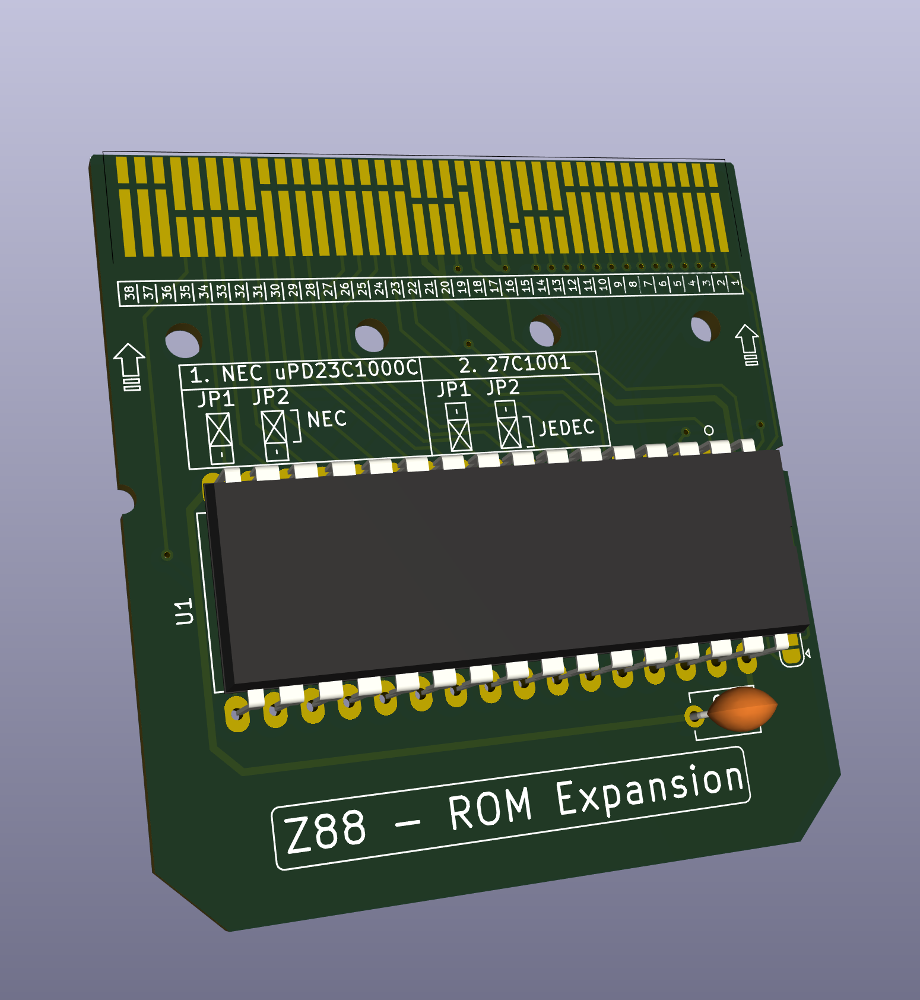
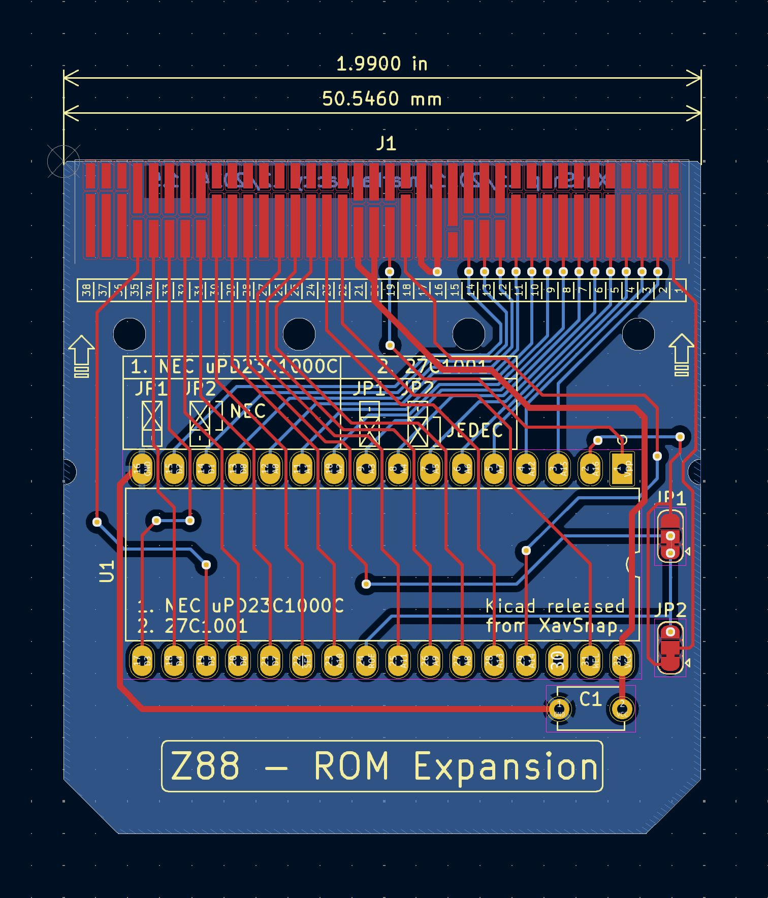

# Z88 EPROM Card
128kB EPROM board for the Cambridge Z88, based on XavSnap's design. 
This version has the correct pin spacing for the edge connector (courtesy of [Jim Conner](github.com/jimconner))

&emsp;

# Current Status
The only circuit change made was the replacement of the connector footprint and the fixing of a silkscreen typo, so the board should work as it sits, but I have not personally built and tested one so YMMV.
